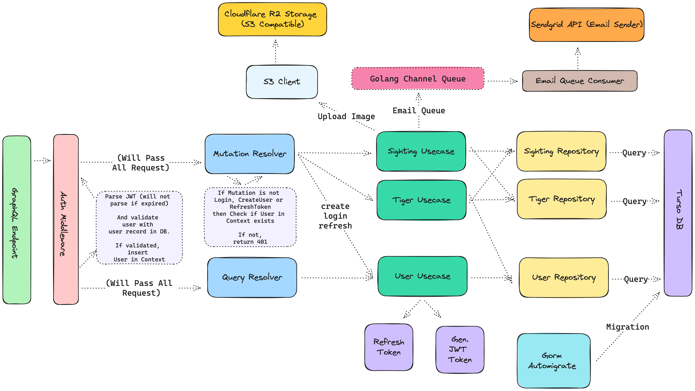

# Tigerhall Kittens

## Introduction
This project is to fulfill my application as a Senior Backend Engineer at Tigerhall. 

## Infrastructure Overview

## Todo List
- [x] Graph the Infrastructure Design
- [x] Create new GraphQL Server with GqlGen
- [x] Create Schema for `User`, `Tiger`, and `Sighting`
- [x] Connect Turso DB
- ~~[ ] Create Migration mechanism (Probably using Automigrate Dry Run & gomigrate)~~
- [x] Create Automigrate
- [x] Create Auth Implementation using JWT and Middleware
- [x] Create CRUD for `User`, `Tiger`, and `Sighting` w/ Pagination
- [ ] Implement Sighting Rules (Only Beyond 5 km from prev. Sightings)
- [ ] Create Message Queue using Go Channel and Send Email Notification on Consumer Side
- [ ] Add transaction for Create operations
- [ ] Create Unit Test for Each Function
- [ ] Create Integration Test for Each Endpoint
- [ ] Create Documentation
- [ ] Create Dockerfile
- [ ] Create Fly io Deployment
- [ ] Fix Migration to use proper Migration Mechanism
- [ ] Better Error Presentation (Maybe add extensions by appending error codes?)
