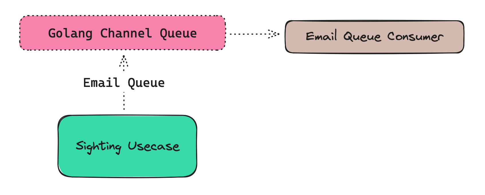

# Email Sender Service
This service is responsible for sending email notifications whenever a new sighting is created. The service is connected to the main server via a rudimentary message queue built using Golang Channel, and it uses SendGrid as the email service provider.

## Why Use SendGrid?
Sending emails is easy task, but due to how nowadays email can be easily spammed, spam filter, security protocols, ana
many security preventions usually will block email sent from unverified source (either not deliver them or mark them as
a spam). By using SendGrid, we can ensure that the email sent from our system will be delivered to the recipient, with extra features such as tracking delivery status, and many more.

## How It Works

It's incredibly simple implementation of message queue by using Golang Channel. The main server will send the email data to the channel, and the email sender service will consume the data from the channel and send the email using SendGrid.
